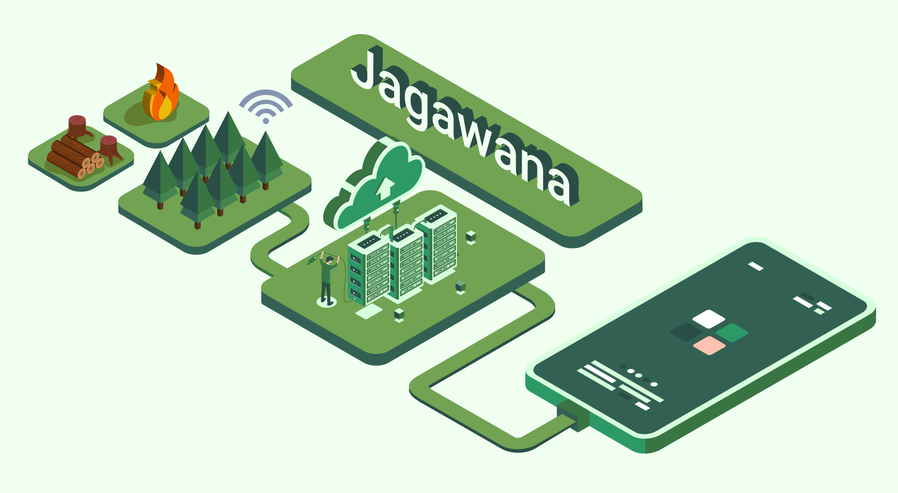

# Jagawana - Machine Learning Notebook

This is a Machine Learning Notebook to classify natural sounds using Augmented-VGG16 Architecture part of the Jagawana Capstone Project.

---

Jagawana is a Forest Logging Prevention System, using Wide Sensor Network to detect and alert chainsaws sounds to users using Android App and Google Cloud Platform. The Machine Learning Model is developed on [Kaggle](https://www.kaggle.com/nicorenaldo/jagawana-forest-logging-detection/). 

We use the dataset ESC-50 to train our model, from [here](https://github.com/karolpiczak/ESC-50) and [here](https://www.kaggle.com/mmoreaux/environmental-sound-classification-50) 

<center></center>

## Getting Started

It's highly recommended to fork our notebook from our [Kaggle Notebook](https://www.kaggle.com/nicorenaldo/jagawana-forest-logging-detection/).

You can start training your own model immediately by modifying the Model Section or load your own model.

## Deploying Model to GCP
It's best to read through the documentation on the link below first. 

After you create your projects on GCP, creating a bucket through the cloud storage, upload the exported model folder to the bucket.

After that, you need to create a modal resource (basically a VM to run your model). Run the following code on your terminal (if you installed Google Cloud SDK) or on the GCP Console Terminal
```
gcloud ai-platform models create MODEL_NAME --region=REGION
```
Change the `MODEL_NAME` to your liking, and choose the `REGION` from this [link](https://cloud.google.com/compute/docs/regions-zones#available).

After you finish, now you need to create a model version finalize the deployment. Write the following code to your terminal.
```
gcloud ai-platform versions create $VERSION_NAME \
  --model=$MODEL_NAME \
  --origin=$MODEL_DIR \
  --runtime-version=2.4 \
  --framework=$FRAMEWORK \
  --python-version=3.7 \
  --region=REGION \
  --machine-type=MACHINE_TYPE
```
You can search the `MACHINE_TYPE` from [here](https://cloud.google.com/ai-platform/prediction/docs/machine-types-online-prediction), and change the other variable suitable to your project. After you finished, check your deployed model with this command.
```
gcloud ai-platform versions describe $VERSION_NAME --model=$MODEL_NAME
```
You will see your model details if your deployment succeed

## Getting Online Predictions
You can get predictions from your deployed model using several way.
1. Use the Cloud Console UI
2. Use the Cloud Console Terminal
3. Use Python Client

---
### Using the Cloud Console UI
Go through the AI Platform Services -> Models -> Find Your Region -> Your Model Name -> Your Model Newest Version -> Test & Use

In there you could put a sample input to your model, this is the easiest method to test your model.

---
### Using the Cloud Console Terminal

Firstly you need to save your sample input to a json file format, and upload it to your console terminal. Then run the following code to get your predictions.
```
gcloud ai-platform predict \
  --model=$MODEL_NAME \
  --version=$VERSION_NAME \
  --json-request=$INPUT_DATA_FILE \
  --region=REGION
```

---
### Using Python Client
Simply follow this [link](https://cloud.google.com/ai-platform/prediction/docs/online-predict#python)

---
## References

[Deploying Models to GCP Docs](https://cloud.google.com/ai-platform/prediction/docs/deploying-models#gcloud_1)

[Getting Online Predictions](https://cloud.google.com/ai-platform/prediction/docs/online-predict#requesting_predictions)

[doofensmirtz Kaggle Notebook](https://www.kaggle.com/doofensmirtz/85-validation-accuracy-tensorflow)

[Rainforest Conservation by Acoustic Surveillance](https://arxiv.org/abs/1908.07517)


